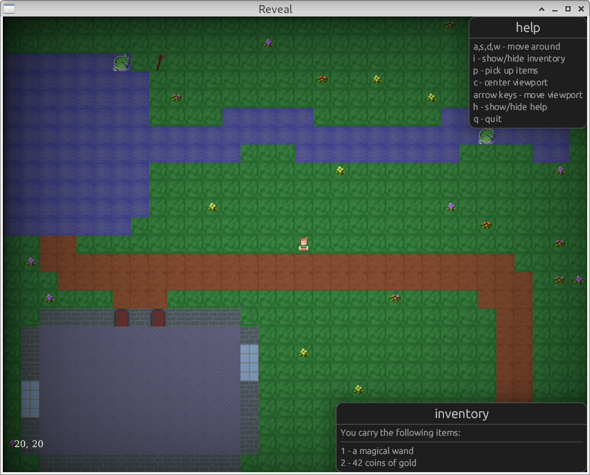
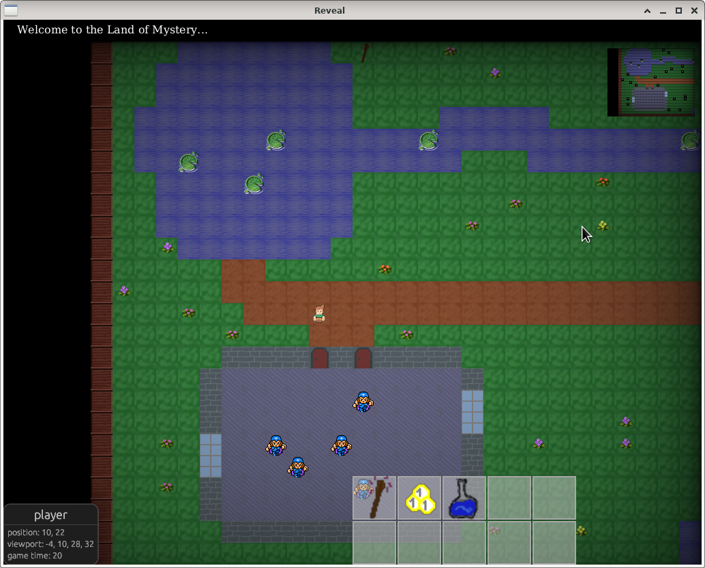

# reveal

A two-dimensional, turn-based, roguelike adventure game

This is work in progress and just a fun project. Don't take it too
serious, but enjoy it if you like!

## Progress

03.06.2021: Very simple demo world. Player movement is possible using
cursor keys. Use q to quit the game.

13.06.2021: A simple inventory is available. Using items (u +
left-click on item) and dropping items (u + right-click on item) is
possible. Several NPCs are spawned, but don't move yet.

